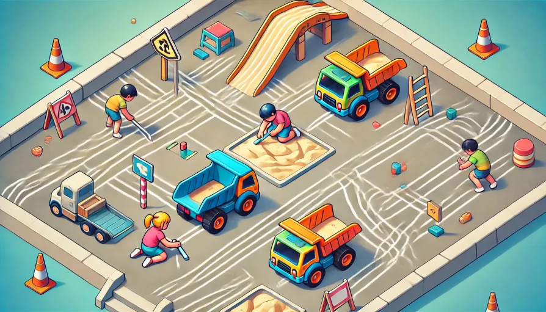
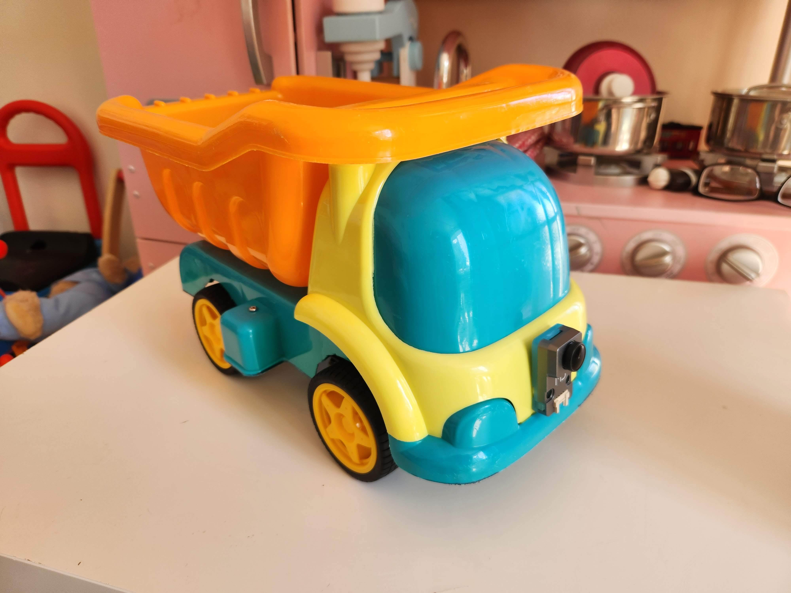
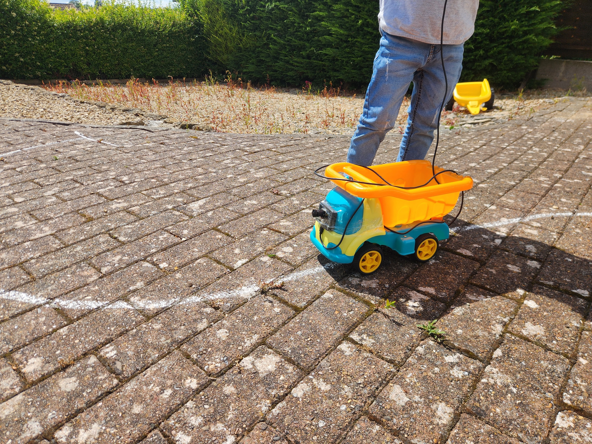
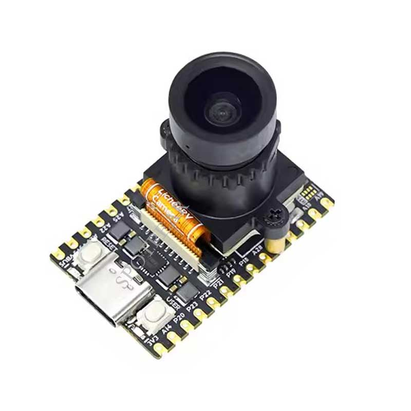
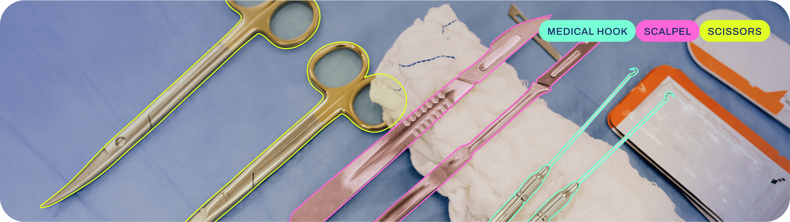
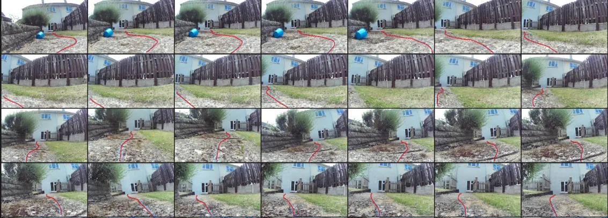

# chalktracks



Building a toy dump truck that can follow lines drawn in chalk.

## About

🚂 Toy trains are fun, but your imagination is limited by how much track you have.

🖍️ What if you could draw the tracks with chalk? 

Introducing 🎉 Chalk Tracks! 🎉

🚚 This project aims to build a toy dump truck that follows tracks drawn in chalk. It will drive where you draw!

We're building this in order to:
* Explore a product idea
* Develop an ML-based portfolio project
* Keep the kids entertained!

The evisaged system consists of a motorised toy dump truck with a forward-facing camera fitted, running a segmentation model for chalk line detection. The bulk of the work will involve building the platform, and developing the chalk line segmentation model.

  

**Figures:** First prototype truck, with camera taped on. 

<br/>

https://github.com/user-attachments/assets/9ad01d09-88ea-4e09-aedb-314ebd87270b

**Video:** First prototype chalk segmentation, video captured on a hand-held smartphone, segmentation model trained on [roboflow](https://roboflow.com/).

### Tech Choices

#### Camera

This project will use the [Sipeed MaixCAM edge AI camera](https://wiki.sipeed.com/hardware/en/maixcam/index.html) for detecting chalk lines.



This was chosen based on:
* **Cost** - this is a very low cost device for running segmentation models onboard. This may be beneficial if this project continues towards productisation - the market for toys is very price sentive.
* **Capability** - despite the cost, the device appears sufficiently performant to run segmentation at a sufficient rate (1TOPS INT8 NPU)
* **Support** - The device appears sufficiently supported with docs, examples and a community forum, to get up and running without too much difficulty. 

#### Segmentation Model

The choice of model to use for chalk segmentation was primarily based on the choice of camera. The MaixCam docs clearly outline the process for deploying [**YoloV8 instance segmentation**](https://docs.ultralytics.com/tasks/segment/), and further Ultralytics provide extensive tooling and documentation supporting the training of these models, hence this is chosen as the model to use for the task.




### Contributors
<a href="https://github.com/chalktracks/chalktracks/graphs/contributors">
  
</a>


## Segmentation Model Training Workflow

**WIP**

This section describes the workflow for training the segmentation model. 

Code will be added and steps will be documented as the project is built out.

1) Hardware setup

    Prepare the truck with motors and camera fitted.

    Wiki todo: add a few photos of building first prototype truck, and notes about the choice of camera

1) Data collection

    Drive the truck over a variety of chalk lines, while recording from the camera.
    1) Copy data collection script to camera, set to autostart
    1) draw chalk lines in the test environment
    1) drive truck around on top of the lines while recording camera images
    1) remove SD card from camera, copy images to dataset directory

1) Save sample videos

    For later demonstration of the segmentation, set aside some video sequences as desired

    TODO: ffmpeg command

1) Key framing

    To reduce labelling workload, filter to a keyframe sequence where images are removed if they are too similar to the previous keyframe.

    `python -m chalk.key_frame --source_image_dir datasets/test_driveway/0_raw_images/ --output_image_dir /tmp/1_keyframes --visualise`

1) Anonymisation 

    Where the dataset contains images of people, blur their faces. Note, no imagery of people will be captured/shared without consent.
    1) Run script to read raw images and blur faces
    2) *manual step*: review output images, manually delete any that failed to blur.

1) Labelling

    Manually annotate the dataset with chalk line lables. Here a simple labelling tool has been developed to annotate the chalk lines with a touch screen interface. After annotation, labels must be converted to appropriate format for training.

    

    **Figure:** a subset of images labelled with the labelling tool.


1) Split into train/test/validation sets

1) Merge with existing datasets

1) Train the model

1) Convert model for target architecture

1) Deploy/test

1) Visualise?
    51 scripts to view labels and model outputs?

The following directory structure is created through the process of collecting raw images up to training the model:
```
dataset_name/
├── 0_raw_images
├── 1_keyframes
├── 2_anonymised
├── 3_labelled
│   ├── images
│   ├── labels
│   └── masks
└── 4_split
    ├── test
    │   ├── images
    │   └── labels
    ├── train
    │   ├── images
    │   └── labels
    └── val
        ├── images
        └── labels

```