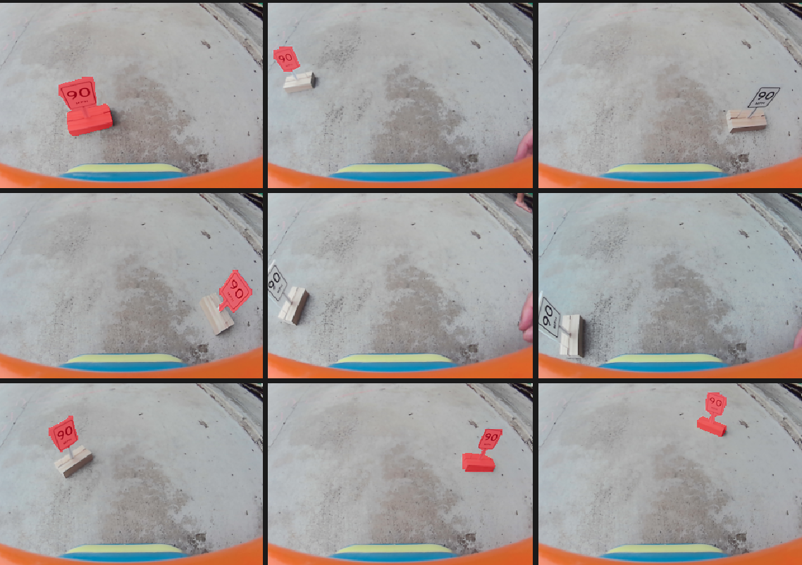
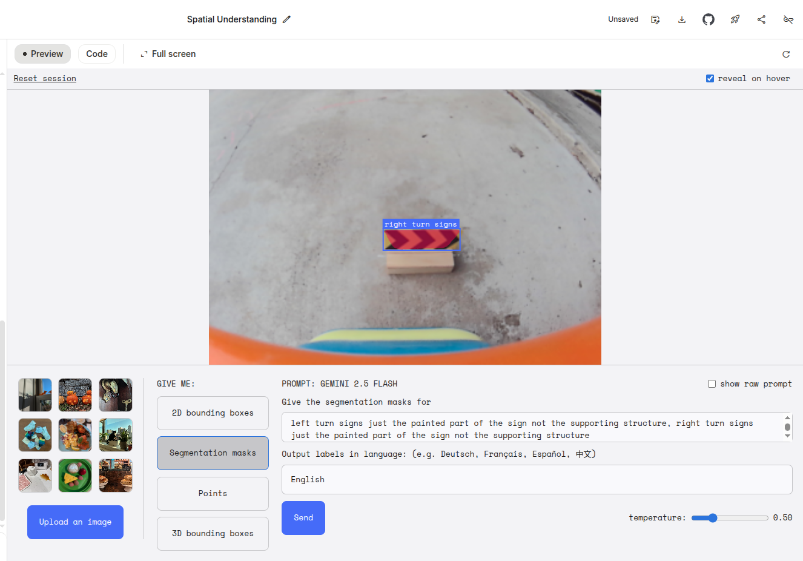
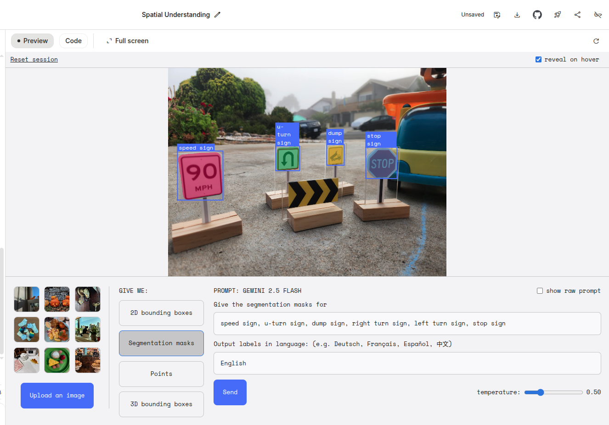

# Auto label trial

Quickly tried [YOLOE](https://docs.ultralytics.com/models/yoloe) for auto-labelling signs. See screenshot of results below.

Comments:
* Just segmented single class "signs"
* Some good results, some missed detections
    * used low thresholds `conf=0.1, iou=0.3`
* Tried with single class "sign", as well as 7 different classes for 7 types of signs
    * different classes got very mixed up
* Maybe best approach:
    * detect generic signs
    * Use CLIP to classify
* Also tried with image prompts (given an image showing all signs, with corresponing bounding boxes)
    * results were better, but with some inter-class confusion
* Will leave this for now and just manually label
    * Guessing I can manully label a big enough dataset quicker than I can set up an auto-labelling pipeline

Also very briefly tried Gemini flash through Google AI Studio:

Comments:

* primising, but only tested on single image
* segmentation masks are a it off, slightly improved with a more verbose prompt

Also tried on an image from my phone with multiple signs

* Quite promising, but perhaps it needs the higher resolution and image quality of my phone, compared to maixcam, to get good reults?
* it missed the turn sign
* still feeling it's not reliable enough - would require correction/filtering results, probably more straight forward to label full dataset manually