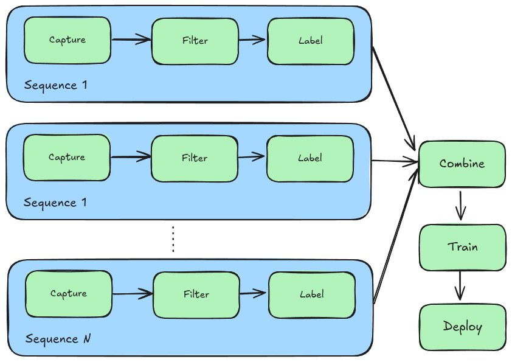

# Training Workflow

This document provides an outline of the process and tooling used to label images and train chalk detection model. 

This process is used to build the dataset, train models, evaluate and iterate.

## Workspace Structure

General idea:
* keep data and training outputs within a workspace
* `data` directory is tracked by dvc/git, can be versioned with git and be backed up using dvc 
* `training` directory is used for training models
* chalktracks repo used as workflow tooling, does not need to be cloned, just pip-installed

Example workspace structure:
```
chalk_workspace/
├── data
│   ├── combined_dataset
│   │   ├── test
│   │   ├── train
│   │   └── val
│   └── sequences
│       ├── 20250712_sequence_quick_test_dataset
│       ├── 20250717_sequence_try_get_blue_working_better
│       ├── 20250720_sequence_round_the_house
│       ├── 20250722_sequence_more_brick
│       └── 20250820_static_truck_printed_signs
└── training
    └── runs
        ├── mlflow
        └── segment
```
The above workspace shows the `data` directory containing several image sequences, and a single combined dataset with test/train/val splits. It also shows the `training` directory with containing artifacts from model training runs. 

The workspace is used through the process of capturing image sequences, filtering them, labelling, comining into a single dataset, training, and deployment.

## Process Overview

The dataset is built by producing a number of labelled "sequences", where a "sequence" refers to a single data collection run with the camera recording images at a given frequency.

Initially sequences are captured to broadly cover expected operating conditions, then after evaluating the model "in the loop" (deployed on the robot), failure cases can be identified and captured in their own sequence (challenging lighting conditions, environments, etc).

Sequences are individually filtered and labelled, before being combined into a single dataset. The combined dataset is used for model training, producing a model file which can be deployed to the camera/robot.



## Chalk tooling

This repository contains the tooling used throughout the various steps of the process. The various tools are bundled into a single pip-installable cli named `chalk`. Top-level usage is as follows:

```
$ chalk --help
usage: chalk [-h] COMMAND ...

Chalk: A command-line tool for chalk line following dataset preparation and model training.

positional arguments:
  COMMAND             Available commands (organized by category)

    [model]
        convert_model      CLI entry point for convert_model command.
        get_default_training_config Generate a default training configuration file.
        train_model        Train a segmentation model using the provided dataset.

    [preprocess]
        add_sequence       Copy raw images into a new sequence directory for dataset preprocessing.
        check_labels       Validate and check consistency of image labels.
        combine_sequences  Combine multiple image sequences into a single dataset.
        label_tool         Launch the interactive labeling tool for annotating images.
        migrate_labels     Migrate labelled data from old format to new format.
        remove_empty_files Find and remove all zero-size files in the specified directory.
        similarity_filter  Filter images based on structural similarity threshold.
        symlink_images     Create symlinks to images from source to destination directory.

    [util]
        mlflow_ui          Start MLflow UI server and optionally open browser.
        view_images        Display images from a directory for visual inspection using FiftyOne.

options:
  -h, --help          show this help message and exit

Use 'chalk COMMAND -h' for detailed help on a specific command.
```

The following sections outline in detail how to use this tool within the data collection and model training workflow.

## Prepare workspace

Setup a workspace for training workflow and install the chalktracks cli tool `chalk` (using [uv](https://docs.astral.sh/uv/) for python env):

```
CHALK_WORKSPACE_DIR=/path/to/use/for/workspace

mkdir $CHALK_WORKSPACE_DIR
cd $CHALK_WORKSPACE_DIR
mkdir data
mkdir training
uv venv
uv pip install git+https://github.com/chalktracks/chalktracks.git
```

The rest of the document assumed the `venv` is activated:
```
. .venv/bin/activate
```

## Build the dataset

### Initialise data directory with dvc tracking

```
cd $CHALK_WORKSPACE_DIR/data
git init
dvc init
dvc config cache.type symlink
git commit -m "dvc init"
mkdir sequences
mkdir combined_dataset
dvc add combined_dataset
git add combined_dataset.dvc .gitignore
git commit -m "dvc add empty data dir"
```

Note on `dvc config cache.type symlink` - before using DVC, I set up the workflow to symlink images across process stage directories to eliminate copies. Then I was confused when DVC got rid of my symlinks after `dvc commit`. AFAIU, it was replacing them with hardlinks. This should be fine, but confused me, so I set cache type to symlink as above, so I could still see my links. Probably I could get rid of all this symlinking and let dvc manage/avoid duplication, will leave it as-is for now. 

### Add a new sequence

TODO: concepts section - what is a sequence?
maybe even a sketch showing how sequences are processed then combined

The following commands are run from the `workspace/data` directory.

Images are imported from `$IMPORT_DIR` and stored in `$SEQUENCE_DIR`. 

E.g. to create a new sequence "my_new_sequence" using images from a camera, set:
```
IMPORT_DIR=/media/my_camera
SEQUENCE_DIR=./sequences/my_new_sequence
```

#### Import

```
chalk add_sequence --image-dir ${IMPORT_DIR} --sequence-dir ${SEQUENCE_DIR}
```

Stores input images under `${SEQUENCE_DIR}/0_raw_images`. Creates sequence directory structure (eg for name `sequence_0`):
```
sequence_0
├── 0_raw_images
├── 1_keyframes
└── 2_labelled
    ├── images
    ├── labels
    └── masks
```

Add new sequence to dvc
```
dvc add ${SEQUENCE_DIR}
git add -u
git commit -m "Add ${SEQUENCE_DIR} raw images"
```


#### Filter

Note the images are stored in `0_raw_images` and symlinked into `1_keyframes` and `2_labelled/images` as required, to avoid copies.


Manual/ad-hoc filtering:
First link files into keyframe dir:
```
chalk symlink_images --from-dir ${SEQUENCE_DIR}/0_raw_images --to-dir ${SEQUENCE_DIR}/1_keyframes
```

Then run filtering scripts as appropriate, potentially including:
```
chalk remove_empty_files ${SEQUENCE_DIR}/1_keyframes/
```

```
chalk similarity_filter --ssim-threshold 0.5 --image-dir ${SEQUENCE_DIR}/1_keyframes/ --dry-run --visualise
```
(remove `--dry-run` flag and rerun when you are happy with the filter results)

And/or, manually view images (eg in gthumb or file browser) and delete non-useful files

When filtering complete, add to dvc
```
dvc add ${SEQUENCE_DIR}
git add -u
git commit -m "completed keyframing for ${SEQUENCE_DIR}"
```

#### Label

Run label tool
```
chalk label_tool ${SEQUENCE_DIR}/1_keyframes/  ${SEQUENCE_DIR}/2_labelled/
```
Label tool runs a UI to assist labelling of images. Will load images from given input directory, and save images (as symlinks), masks and labels to given output directory.

To inspect the labelled sequence;
```
chalk view_images ${SEQUENCE_DIR}/2_labelled/
```


Save labels 
```
dvc add ${SEQUENCE_DIR}
git add -u
git commit -m "completed labelling for ${SEQUENCE_DIR}"
```


#### Assemble combined dataset

Combine all sequences into a final dataset with test/train/val splits:
```
chalk combine_sequences --sequence-dir ./sequences/ --combined-dir ./combined_dataset/
```

Save combined dataset 
```
dvc commit
git add -u
git commit -m "built dataset from existing sequences"
```

#### (optional) Tag a dataset version

For easier data version tracking, tag the current version:

```
git tag v1.0.0   # chose version as appropriate
```

## Train the model

Training is performed from the workspace training directory. All following commands will run from this directory:
```
cd $CHALK_WORKSPACE_DIR/training
```

### Set config

Training params can be modified via config file. Write a default config to the training directory:
```
chalk get_default_training_config
```
This will save `config.yaml` to the current dir, which can then be modified as desired.

### Train

Training can now begin:

```
chalk train_model $CHALK_WORKSPACE_DIR/data/combined_dataset/data.yaml config.yaml
```

This may take some time, depending on dataset size and training configuration.

Training artifacts are saved under `runs/segment/<run_name>`, and mlflow metrics are saved under `runs/mlflow/`.

The `.cvimodel` and `.mud` files for deploying the trained model to Maixcam are saved under `runs/segment/<run-name>/weights/`.

Run names are randomly generated and printed to the terminal during training. 


To browse training records, the mlflow server can be launched with:
```
chalk mlflow_ui $CHALK_WORKSPACE_DIR/training/runs/mlflow
``` 

TODO
* document migration script
* some way to run the model locally? Can I run it from my webcam?
* add warning/troubleshooting section
warn about error:
```
4 compared
3 passed
0 equal, 0 close, 3 similar
1 failed
0 not equal, 1 not similar
min_similiarity = (0.0, -0.9999894278362753, 11.905434131622314)
Target yolov11n-seg-chalk_cv181x_int8_sym_tpu_outputs.npz
Reference yolov11n-seg-chalk_top_outputs.npz
npz compare FAILED.
```
-> went away when training 200 epochs 


## Other scripts

### Migrate labels

Should no longer be needed, at one point I needed to update label formats, keeping notes here in case I need to do something similar in future.

Because the dvc cache is configured to symlink (TODO reconsider this decision), the [files need to be unprotected](https://dvc.org/doc/user-guide/how-to/update-tracked-data#modifying-content) before modification, then re-added to dvc on completion. Full process for a single sequence:

```
dvc unprotect ${SEQUENCE_DIR}
chalk migrate_labels ${SEQUENCE_DIR}
dvc add ${SEQUENCE_DIR}
git add -u
git commit "migrate labels for ${SEQUENCE_DIR}"
```
Recursively finds and updates:
    * masks from RGB to int image
    * label txt from chalk = 0 to current label convention.


Scratch space - thinking about chalk repo, what scripts will exist?


preprocess:
    add_sequence --image-dir /path/to/images --sequence-dir /path/to/sequence/storage --seq-name 20250817_my_new_sequence
    symlink_images --from-dir sequence_dir/sequence_name/0_raw_images --to-dir sequence_dir/sequence_name/1_keyframes
    similarity_filter --ssim-threshold 0.5 --image-dir sequence_dir/sequence_name/1_keyframes
    label_tool sequence_dir/sequence_name/2_labelled
    combine_sequences --sequence-dir /path/to/sequence/storage --combined-dir /path/to/combined/storage
    check_labels /path/to/labelled/images
    migrate_labels /path/to/data/dir

model:
    train_model /path/to/data /path/to/params.yaml
    convert_model /path/to/input/dir /path/to/output/dir

util:
    view_images /path/to/image/dir
